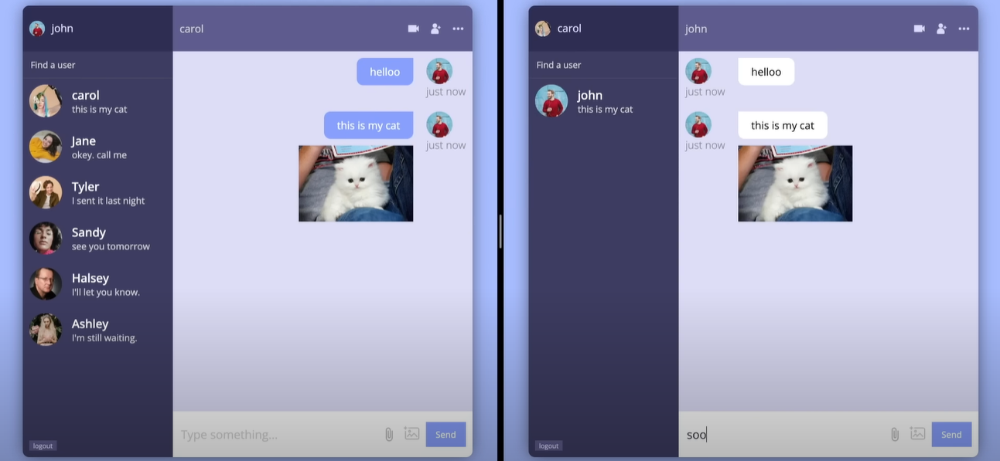

# REACT X CHAT APP

## Have a look at the project

### Project link

<https://chat-b4d42.web.app>



## Description

Chat app that makes it easy to communicate with people anywhere by sending and receiving messages in real time.
Project written in React.js, Sass and firebase.

The application was deployed on Firebase Hosting

## Functionality

### Unauthorized user

- Redirect to signup page
- Can register using username and email
- Can log in after the registration

### Authorized user

- Search for users in the database under key words
- Save chats in sidebar

### Layout

- Element positioning using flexbox

## Routes

- `/` — main page
- `/signin` & `/signup` — pages of registration and authorization

## Technologies used

- React.js, JSX
- Sass
- BEM-methodology
- React Router DOM
- Working with forms

## Some of the skills used are

- Project structures
- Debugging and React DevTools
- Hooks and effect dependencies
- Creating and subscribing to a context

## TODO

- [ ] Forms validation
- [ ] Edit their username and email
- [ ] Delete chats from sidebar
- [ ] Adaptive layout - optimized for different screen resolutions (mobile, tablet, desktop)
- [ ] Change user avatar
- [ ] Send files
- [ ] Audio calls
- [ ] Video calls

## Start project locally

```bash
git clone https://github.com/artemshchirov/react-chat-app.git
cd react-chat-app
npm install
npm start
```
